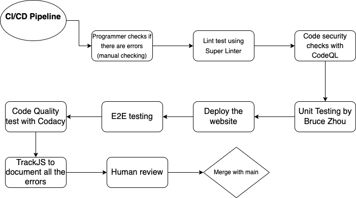

# Pipeline status

In our project, we have the following workflows currently functional:

* Linting and Code Style Enforcement (Super-Linter)

  Every time new commits are pushed, the super-linter workflow will be triggered and lint the codebase. It will analysis the codebase and detect any underlying bugs of it.
  Moreover, it will check the style of the codebase for ensuring consistent code style. The super-linter supports several languages, and all languages we use in our project (HTML, CSS, JavaScript, Markdown) are supported by it and thus can be linted.
  
  Examples of errors that lint can detect include the following:

  - Indexing beyond arrays
  - (Potentially) dangerous data type combinations
  - Unreachable code

* Code Quality via Tool (CodeQL)

  Every time new commits are pushed, the CodeQL workflow will be triggered and do the following:

  * Checkout repositoryository
  * Initialize CodeQL
  * Perform CodeQL Analysis
  * Post Perform CodeQL Analysis
  * Post Initialize CodeQL
  * Post Initialize CodeQL

  The basic idea of CodeQL is that it will generate a database to repositoryresent the codebase, and then run queries on the generated database to identify problems in the codebase. It supports several languages. We use JavaScript for our purpose.

  Currently, we can pass the CodeQL scanning for most of the times.

* Code Quality via Human Review

  Every time new pull requests are made, GitHub will recommend reviewers to review the code based on the files changed. Then the reviewers will check the code and point out in slack if any problems are found.
  
* Pages-Build-Deployment

  The default action by GitHub page. This action will be performed whenever the repository's content is changed and deploy the site accordingly.

* Unit Tests via Automation

  Every time new commits are pushed, the CI workflow will be triggered. It will do the following by sequence:
  
  * Install ```jest```
  * Print ```running tests``` on screen
  * Run ```npm test```
  
  Therefore, it will run all the test files found in our repository and report the results. Currently, we have a lot failed tasks, and we are trying to fix them manually until all the tasks can be passed. Update: we have passed all formatting tests, but we still need a lot of unit tests
  
  